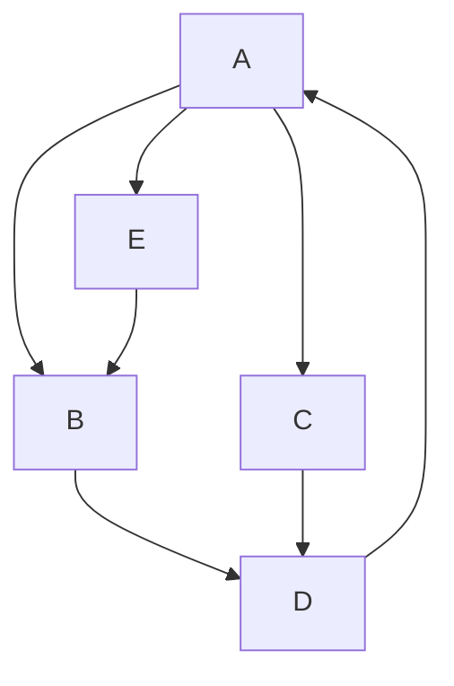

# 告示栏

:::note
**生存**还是**死亡**
:::

:::tip
**生存**还是**死亡**
:::
:::info
**生存**还是**死亡**
:::

:::warning
**生存**还是**死亡**
:::

:::danger
**生存**还是**死亡**
:::

:::note

Some **content** with _Markdown_ `syntax`. Check [this `api`](#).

:::

:::tip

Some **content** with _Markdown_ `syntax`. Check [this `api`](#).

:::

:::info

Some **content** with _Markdown_ `syntax`. Check [this `api`](#).

:::

:::warning

Some **content** with _Markdown_ `syntax`. Check [this `api`](#).

:::

:::danger

Some **content** with _Markdown_ `syntax`. Check [this `api`](#).

:::

{/* <!-- Prettier doesn't change this -->
:::note

Hello world

:::

 
<!-- Prettier change this -->
:::note
Hello worldadssssssssssssssssssssssssssssssssssssssssssssssssssssssdadasdad
::: */}
 

# 自定义标题
:::note[Your Title **with** some _Markdown_ `syntax`!]

Some **content** with some _Markdown_ `syntax`.
:::

:::warning[随便写写***随便* `写写`]
Some **content** with some _Markdown_ `syntax`.

:::

# MDX 的告诫
您也可以在告诫中使用 MDX！

import Tabs from '@theme/Tabs';

import TabItem from '@theme/TabItem';

:::tip[Use tabs in admonitions]

<Tabs>
  <TabItem value="apple" label="Apple">This is an apple 🍎</TabItem>
  <TabItem value="orange" label="Orange">This is an orange 🍊</TabItem>
  <TabItem value="banana" label="Banana">This is a banana 🍌</TabItem>
</Tabs>

:::

[link](#heading-id)
[超链接](admonitions)

## Hello World {#admonitions1}
#### 测试1

import TOCInline from '@theme/TOCInline';

<TOCInline toc={toc} />

 
<TOCInline toc={toc} />

Some details containing headings

<h2 id="#heading-id">I'm a heading that will not show up in the TOC</h2>

Some content...

ces 

Let $f\colon[a,b]\to\R$ be Riemann integrable. Let $F\colon[a,b]\to\R$ be
$F(x)=\int_{a}^{x} f(t)\,dt$. Then $F$ is continuous, and at all $x$ such that
$f$ is continuous at $x$, $F$ is differentiable at $x$ with $F'(x)=f(x)$.

Let $f\colon[a,b]\to\R$ be Riemann integrable. Let $F\colon[a,b]\to\R$ be
$F(x)=\int_{a}^{x} f(t)\,dt$. Then $F$ is continuous, and at all $x$ such that
$f$ is continuous at $x$, $F$ is differentiable at $x$ with $F'(x)=f(x)$.

$$
I = \int_0^{2\pi} \sin(x)\,dx
$$

import Mermaid from '@theme/Mermaid';

<Mermaid
  value={`graph TD;
    A-->B;
    A-->C;
    B-->D;
    C-->D;
    D-->F;
    `}
/>

<head>
  <html className="some-extra-html-class" />
  <body className="other-extra-body-class" />
  <title>Head Metadata customized title!</title>
  <meta charSet="utf-8" />
  <meta name="twitter:card" content="summary" />
  <link rel="canonical" href="https://docusaurus.io/docs/markdown-features/head-metadata" />
</head>

# Head Metadata

# Title

 

    <h3 className="purple-text">Purple Heading!</h3>

<h3 class="purple-heading">Purple Heading!</h3>
### Purple Heading!

import SomeComponent from '@theme/SomeComponent';

<SomeComponent>
  <h2>Hello</h2>
  
This is wrapped by SomeComponent.

</SomeComponent>

 

 

